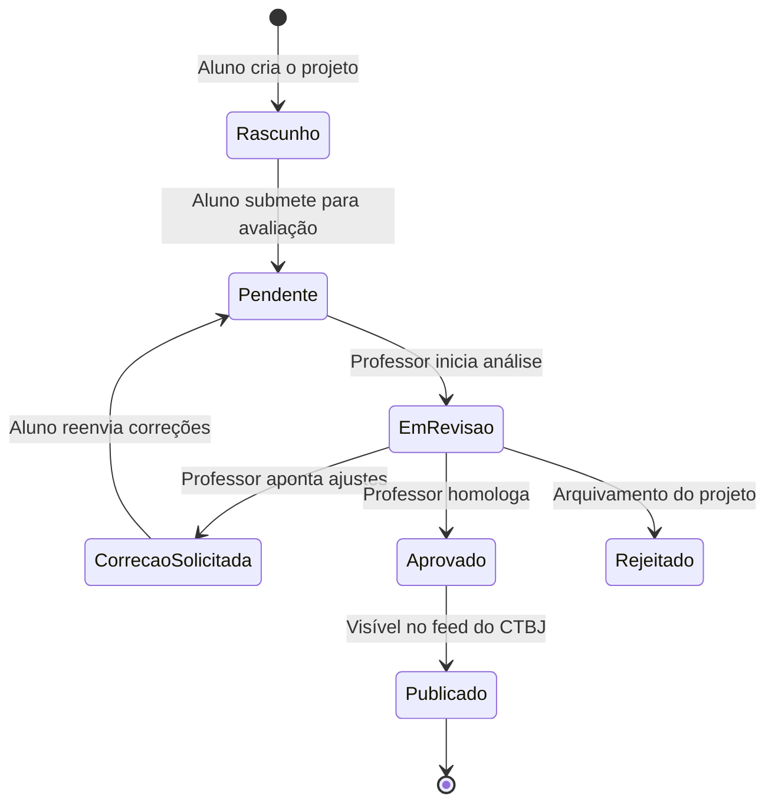

requisitos

#  Mural Virtual de Projetos

Este documento detalha os requisitos de engenharia, arquitetura de software, restrições e regras de negócio que governam a Rede de Murais Virtuais Escolares, utilizando como ambiente homologador o **Colégio Técnico de Bom Jesus (CTBJ/UFPI)**.

---

##  1. Atores e Usuários do Sistema (Actors)

*   **Super Administrador (SuperAdmin):** Responsável pela infraestrutura global, provisionamento de novos *tenants* (instituições), auditoria de logs e métricas de desempenho.
*   **Administrador Institucional (Admin Local):** Direção ou Coordenação do CTBJ (ou outras escolas). Possui controle total sobre o nó da sua instituição: moderação de projetos, gerenciamento de cursos/eixos tecnológicos, e cadastro de professores.
*   **Orientador / Professor:** Usuário com permissão para validar e aprovar submissões de projetos de seus respectivos alunos antes da publicação oficial.
*   **Estudante / Autor:** Usuário vinculado a uma instituição e curso. Possui autonomia para criar perfis de projetos onde atuou como desenvolvedor/pesquisador.
*   **Usuário Externo / Visitante:** Comunidade geral, recrutadores e avaliadores. Acesso público e anônimo para visualização e interação social básica (curtidas/compartilhamentos).

---

##  2. Requisitos Funcionais (RF)

### 2.1. Módulo de Multi-Tenancy e Isolamento
*   **RF-001:** O sistema deve isolar logicamente os dados de cada instituição de ensino através do identificador único `tenant_id` nas tabelas do banco de dados.
*   **RF-002:** O sistema deve rotear o acesso baseado no subdomínio da requisição (Ex: `://muralvirtual.com` direciona para o escopo do Colégio Técnico de Bom Jesus).

### 2.2. Módulo de Gestão de Projetos
*   **RF-003:** O estudante deve submeter projetos contendo: Título, Resumo Textual, Eixo Tecnológico (Curso), Nome do Orientador, Coautores, Imagem de Capa, Link do Repositório (GitHub/GitLab) e Arquivo do Artigo/Relatório em PDF.
*   **RF-004:** O sistema deve permitir o agrupamento de projetos por categorias customizáveis criadas pela instituição (Ex: Agropecuária, Informática, Robotica, Startup e Enfermagem).

### 2.3. Módulo de Fluxo de Trabalho (Workflow de Aprovação)
*   **RF-005:** Um projeto submetido por um aluno deve entrar em estado `Pendente` e disparar uma notificação para o orientador indicado.
*   **RF-006:** O professor orientador deve ter a capacidade de `Aprovar`, `Rejeitar` ou `Solicitar Alterações` (com feedback textual) no projeto submetido.
*   **RF-007:** O projeto só se tornará público no feed do tenant após a transição de estado para `Aprovado` por um Professor ou Admin Local.

### 2.4. Módulo de Interação e Descoberta
*   **RF-008:** O visitante deve conseguir realizar buscas por texto completo (*Full-Text Search*) indexando títulos, resumos e tags dos projetos.
*   **RF-009:** O sistema deve disponibilizar um mecanismo de computação de curtidas (*Likes*) assíncrono para evitar concorrência direta no banco de dados.

---

##  3. Requisitos Não Funcionais (RNF)

*   **RNF-001 (Desempenho):** O tempo de resposta para a renderização da página inicial do mural (feed público) não deve exceder 1.5 segundos sob carga normal (até 500 requisições simultâneas por tenant).
*   **RNF-002 (Disponibilidade):** A arquitetura deve garantir um SLA de disponibilidade de 99.7% utilizando redundância de microsserviços.
*   **RNF-003 (Segurança - LGPD):** Todos os dados sensíveis dos alunos (como CPF, e-mail e senhas) devem ser criptografados na base de dados utilizando o algoritmo `AES-256` ou `bcrypt` para hashing de credenciais.
*   **RNF-004 (Escalabilidade):** O armazenamento de arquivos estáticos (PDFs e Imagens) deve ser desacoplado do servidor de aplicação, utilizando buckets de armazenamento de objetos com CDN (Content Delivery Network).
*   **RNF-005 (Portabilidade):** O frontend deve ser totalmente responsivo, adaptando-se a resoluções desde dispositivos móveis (320px) até monitores Desktop (4K).

---

##  4. Regras e Condições de Negócio (RN)

*   **RN-001 (Vínculo de Coautoria):** Um estudante só pode adicionar coautores em seu projeto se estes estiverem previamente cadastrados e ativos no mesmo `tenant_id`.
*   **RN-002 (Limite de Upload):** O tamanho máximo permitido para o arquivo PDF do projeto é de 15MB. Imagens de capa estão limitadas a 5MB nos formatos PNG, JPG ou WebP.
*   **RN-003 (Exclusão Própria):** Um aluno não pode excluir um projeto que já foi homologado e publicado sem a autorização expressa e abertura de chamado com o Admin Local.
*   **RN-004 (Configuração de Tenant):** Uma nova instituição só será ativada na rede após validação do domínio institucional de e-mail (Ex: `@ufpi.edu.br` ou `@etbj.ufpi.br`) pelo SuperAdmin.

---

##  5. Requisitos de Infraestrutura (Hardware e Software)

### 5.1. Ambiente de Execução do Usuário (Client-Side)
*   **Software:** Navegadores modernos com suporte a ECMAScript 6+ (Google Chrome >= 90, Mozilla Firefox >= 88, Safari >= 14, Microsoft Edge).
*   **Hardware Mínimo:** Dispositivo móvel ou desktop com 2GB de RAM livre e conexão ativa com a internet (mínimo de 1 Mbps).

### 5.2. Ambiente de Servidor Recomendado (Server-Side / Cloud)
*   **Runtime Backend:** Node.js v20.x LTS ou Python 3.11+.
*   **Banco de Dados:** PostgreSQL 15+ com extensão `pg_trgm` ativada para otimização de buscas textuais.
*   **Servidor de Aplicação (Mínimo para homologação no CTBJ):**
    *   **CPU:** 2 vCPUs v Compute-Optimized.
    *   **Memória RAM:** 4GB RAM.
    *   **Armazenamento:** 20GB SSD NVMe (Instalação do SO e Logs).
*   **Object Storage:** Solução compatível com S3 (AWS S3, Cloudflare R2 ou Supabase Storage) provisionada com políticas de CORS estritas.

---

##  6. Diagrama de Transição de Estados do Projeto

